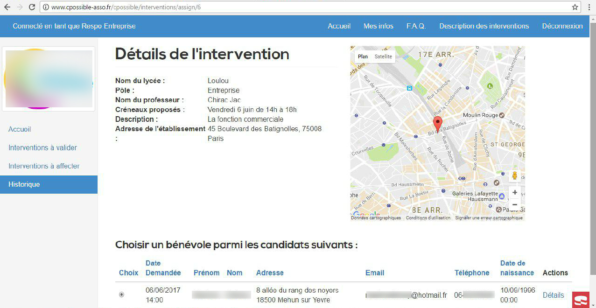

# Teaching association website

This is an intranet I made within Centrale's Junior Enterprise for a French association, whose name I can't disclosure.
It is written mainly with cakePHP.

## Features

This Intranet manages the lectures of volunteers in highschool classes. It is divided in three poles (culture, values and enterprise) and has the following features :

- Five types of accounts : teachers, highschools, volunteers, pole managers and admin
- Teachers can ask for interventions in their schools
- Volunteers can candidate for the ones they like
- Pole managers can validate interventions before they go public, and select the best candidate once published
- Highschools can see every information concerning interventions in their classes
- Admin can do all of the above
- Generally, beautiful and responsive dashboards for all these roles
- Many automatic reminder emails
- Feedback system both for the volunteer and the teacher
- Much more !

## Installation

To deploy this website, you have to follow these steps :

- Make sure `intl` and `mbstring` are activated for PHP.  
- Set up a database server, on which you have to run the file cpossible.sql
- Edit the file config/app.php : replace the mail server infos in the sections 1 and 2, and the database server info on the section 3, which you can find at the following lines :
  1. EmailTransport (l. 180)
  2. Email (l. 201)
  3. Datasources (l. 218)  

This is usually enough to deploy the website, but you may have to fellow specific steps on your server.
